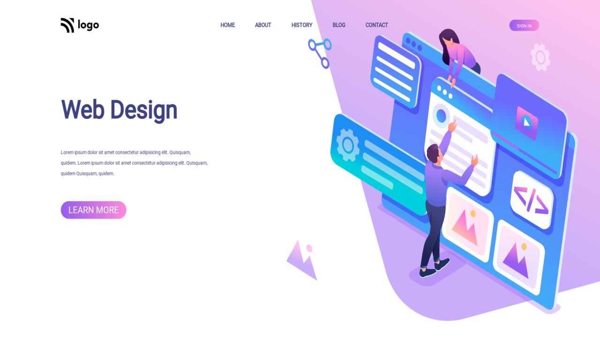

# Project 8

## `Nishok Maharaaj`

## Learnings     

In the eighth project of HTML and CSS class I have learnt mostly about positioning in CSS which is used mostly in alignment of the image and the text.

## [Live Project Demo](https://nishok-html-css-proj8.netlify.app/)

## Efforts

This project took around 2 hours to build just because of the image and the alignment of icons around it.

### Screenshot

